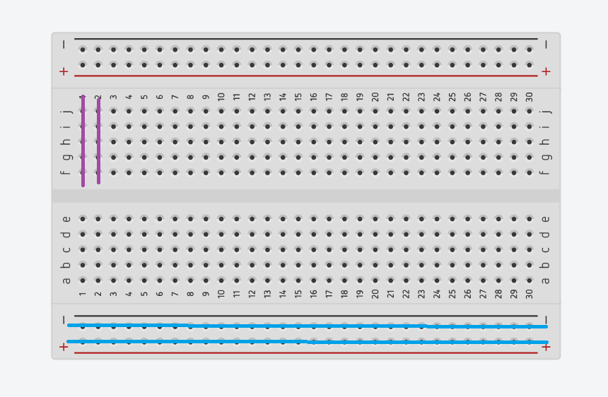
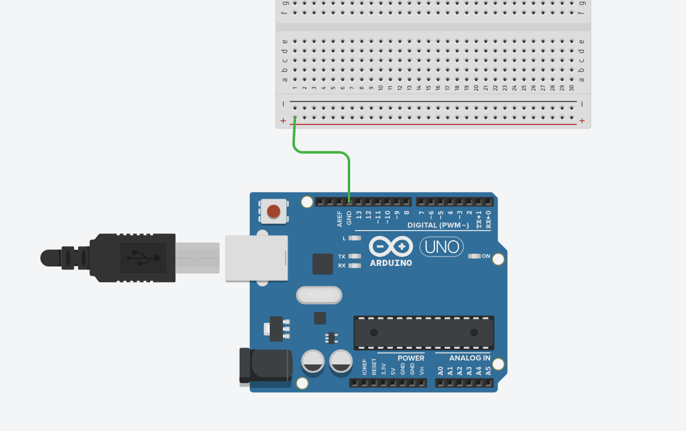
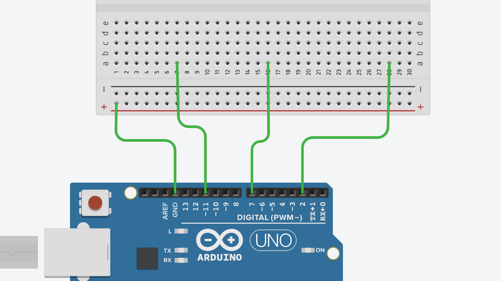
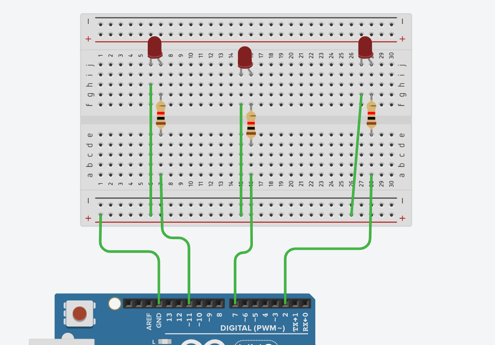
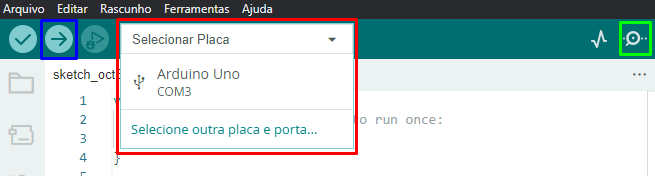
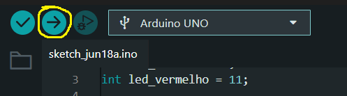
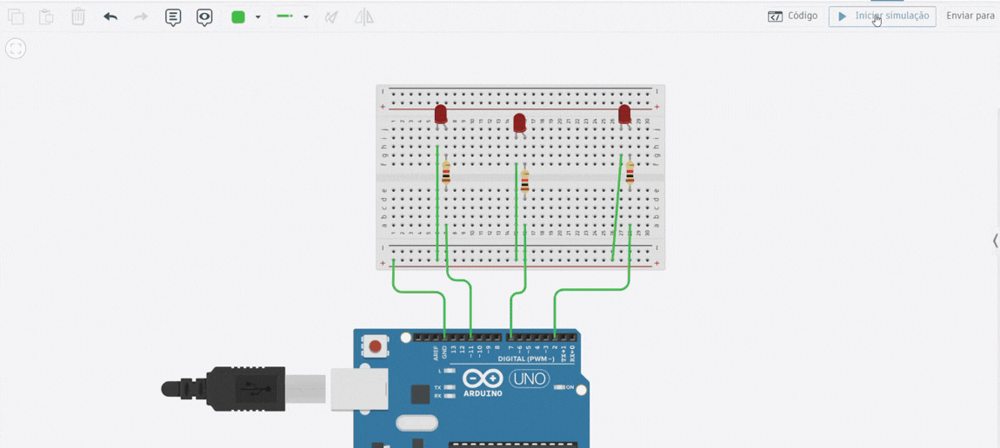

# Basic Project Eletronics - Traffic Light
Projeto básico de eletrônica para iniciar os estudos usando Arduino Uno.
Será demonstrado como construir um semáforo de trânsito utilizando um microcontrolador (Nesse caso, Arduino Uno).

# Ideia central
A principal ideia é utilizar o Arduino Uno para programar 3 leds ao mesmo tempo. 
Os leds funcionarão como um semáforo. O primeiro a ligar é o vermelho, depois de um tempo o amarelo e então o verde. Abaixo, estará listado os passos de como replicar este projeto para testes.
As imagens abaixo serão do [Thinkerpad](https://www.tinkercad.com/dashboard), um simulador usado para replicar projetos com componentes eletrônicos. Foi utilizado aqui principalmente para evitar queimar algum LED durante a construção dele.
Você também pode acessá-lo para testar este projeto, ou usá-lo para construir o seu próprio físico, basta clicar em cima. Ao final, deixo um vídeo do circuito funcionando fisicamente.

### Componentes de Software necessários:
- [IDE Arduino](https://www.arduino.cc/en/software/).

### Componentes Físicos necessários:
- 1 microcontrolador - Nesse caso, será usado o Arduino Uno.
- 3 LEDs (1 vermelho, 1 amarelo, 1 verde)
- 3 Resistores.
- 1 Protoboard.
- Jumpers Macho-Macho (Fios).

## HARDWARE: A alimentação do Arduino e ligação com os LEDs.
- Primeiramente, a alimentação do Arduino é por meio da sua entrada USB tipo B que é conectada ao computador ou utilizando uma fonte de alimentação. A tensão máxima do Arduino é 5V, portanto cuidado ao conectar qualquer fonte para alimentá-lo.
- Para começar o projeto, conecte seu Arduino no computador, para alimentá-lo e ser possível programá-lo.

Antes de começar, é importante mostrar como é a distribuição de energia na Protoboard:
- As trilhas laterais (as com símbolo de positivo + e negativo -) possuem transferência de energia na horizontal.
- As trilhas centrais possuem transferência de energia na vertical.
- Veja as linhas na imagem abaixo. Elas mostram visualmente por onde a corrente passa quando as trilhas estão energizadas.



Agora, vamos aos passos para montar o circuito.

### 1. Conectar o GND a Protoboard:
- Vamos fazer a ligação entre o Arduino e o LED de forma correta. Primeiramente, pegue sua Protoboard e conecte um cabo ao GND do Arduino e a trilha positiva (com símbolo '+') da Protoboard.
- O GND é o aterramento do circuito, onde o nosso circuito se "fecha". No sentido convencional, a energia chega ao circuito pelos pinos de carga positiva, passa pelos componentes e vai ao GND para fechar o circuito.
Veja a figura:



É nessa trilha que o GND está "correndo".

### 2. Energizar uma trilha.
- Agora, escolha três pinos diferentes de onde a energia do Arduino sairá para chegar até o LED e conecte-os a uma trilha da Protoboard



- Veja que agora as trilhas 7, 16 e 28 da Protoboard estão energizadas, exatamente daquela forma que foi mostrado, pelos pinos 11, 7 e 2 do Arduino, respectivamente.

### 3. Energizar o LED e fechar o circuito.
- Para energizar efetivamente o LED, vamos precisar de colocá-lo na Protoboard. A ligação deve ser da seguinte forma:
1. Identifique o ânodo do LED (é a perna **maior**).
2. **NÃO CONECTE** diretamente o LED na trilha energizada pelos pinos do Arduino, você poderá **QUEIMÁ-LO**. Conecte um resistor até a trilha superior (que ainda não está energizada, apenas a debaixo, como está na imagem). O resistor atua como um condutor (bem como os fios de ligação) que diminui a potência da corrente. Portanto a corrente chegará ao LED de forma segura.
3. Na outra perna do LED (a menor) conectaremos a trilha positiva + (onde foi conectado o GND do Arduino) a esta perna, fechando o circuito.



- Observe que alguns resistores e alguns fios estão conectados em lugares diferentes na mesma trilha. Isso **não importa**, pois o que importa é a corrente na trilha. Fiz isso para mostrar visualmente que funciona. Observe o GND conectado também.
- A parte de hardware está completa, agora vamos para a programação.

## SOFTWARE: A programação do Arduino para funcionamento do Semáforo.

### Primeiros passos:
1. Conecte o seu Arduino no computador. A porta USB-B vai no Arduino e a outra vai no computador.
2. Instale a [IDE Arduino](https://www.arduino.cc/en/software/). Não vou dar maiores instruções de instalação, para mais detalhes, pesquise sobre a instalação e configurações da IDE do Arduino.
3. Na IDE, você vai precisar selecionar o modelo do seu Arduino (que nesse projeto é o Arduino Uno) e a porta USB do computador em que ele está conectado. Veja a imagem:



Pronto, agora vamos à programação.

OBS.: A extensão dos arquivos de códigos salvos pela IDE do Arduino é **.ino**, e não .cpp (que é o padrão da linguagem C++).

### Programando o Arduino.
A linguagem de programação no Arduino é o C++, por questões específicas em relação a linguagem C. Se você está aqui, já deve ter alguma noção de programação

#### 1. Definindo as variáveis.
As variáveis receberão o valor de cada pino que será usado para acender os LEDs.
```
int led_verde = 2;
int led_amarelo = 7;
int led_vermelho = 11;
```

#### 2. Definindo o Setup.
No Arduino, a função ``setup()`` que não possui retorno, indica o que será feito antes da execução principal do programa em si. São as configurações iniciais.
```
void setup(){
    pinMode(led_verde, OUTPUT);
    pinMode(led_amarelo, OUTPUT);
    pinMode(led_vermelho, OUTPUT);
}
```
- A função ``pinMode()`` serve para definir se um pino será entrada de dados (INPUT) ou saída de dados (OUTPUT). Nesse caso, como vamos acender LEDs, precisamos que o pino indicado pela variável (como ``led_verde``, que nesse caso é o pino 2) se comporte como uma saída de dados, enviando um sinal elétrico. É esse sinal que acenderá o LED.

#### 3. Definindo a função principal.
A função principal do Arduino é a função ``loop()``. Nela, as intruções são lidas e passadas para o Arduino de forma contínua e em loop. Ao chegar ao final, ela retorna ao início e repete os comandos que estão ali dentro.
```
void loop(){
    digitalWrite(led_vermelho, HIGH);
    delay(5000);
    digitalWrite(led_vermelho, LOW);

    digitalWrite(led_verde, HIGH);
    delay(3000);
    digitalWrite(led_verde, LOW);

    digitalWrite(led_amarelo, HIGH);
    delay(1500);
    digitalWrite(led_amarelo, LOW);
}
```
- A função ``digitalWrite()`` serve para enviar um sinal elétrico (nível lógico) para um pino do Arduino. Observe então que enviamos primeiro um sinal ``HIGH`` para o pino ``led_vermelho``, que foi definido como 11. Isso liga o LED conectado a este pino 11. Depois, enviamos o sinal ``LOW`` para o mesmo pino, o que desliga o LED.
- Entre esse jogo de sinal elétrico, temos a função ``delay()``, que é basicamente uma função de "espera". O programa lê ``digitalWrite()``, espera o valor definido no ``delay()`` (em milissegundos) e depois lê o próximo ``digitalWrite()``.
- Observe que quando há a "troca" de LEDs (um apaga e o outro acende), não colocamos ``delay()``, pois a ideia é imitar um semáforo de trânsito, e seu funcionamento exige que quando uma luz apague, outra acenda instantaneamente.

OBS.: Para seu programa funcionar, basta clicar no local indicado na imagem. A própria IDE compila e faz o upload do programa para o Arduino. Assim que isso termina, o circuito passa a funcionar.



## Programa Final e Circuito montado funcionando.
### Programa final:
```
int led_verde = 2; 
int led_amarelo = 7;
int led_vermelho = 11;

void setup() {
  pinMode(led_verde, OUTPUT);
  pinMode(led_amarelo, OUTPUT);
  pinMode(led_vermelho, OUTPUT);
}

void loop() { 
  digitalWrite(led_vermelho, HIGH);
  delay(5000); //5 segundos.
  digitalWrite(led_vermelho, LOW);
  
  digitalWrite(led_verde, HIGH);
  delay(3000); //3 segundos.
  digitalWrite(led_verde, LOW);
  
  digitalWrite(led_amarelo, HIGH);
  delay(1500); //1,5 segundos.
  digitalWrite(led_amarelo, LOW);
}
```

### Vídeos (Gifs) do circuito funcionando (Simulador e Físico):

#### Simulador:



#### Físico:

